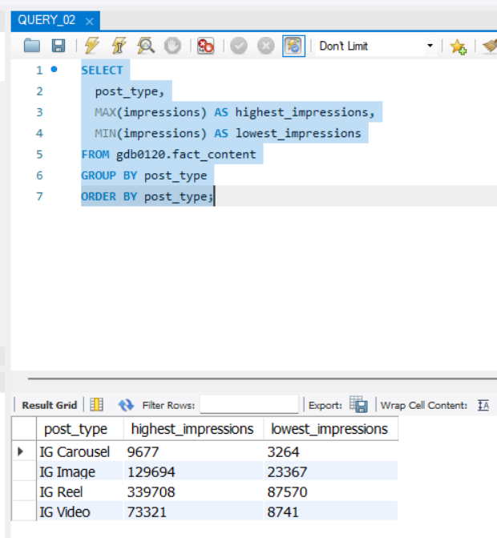
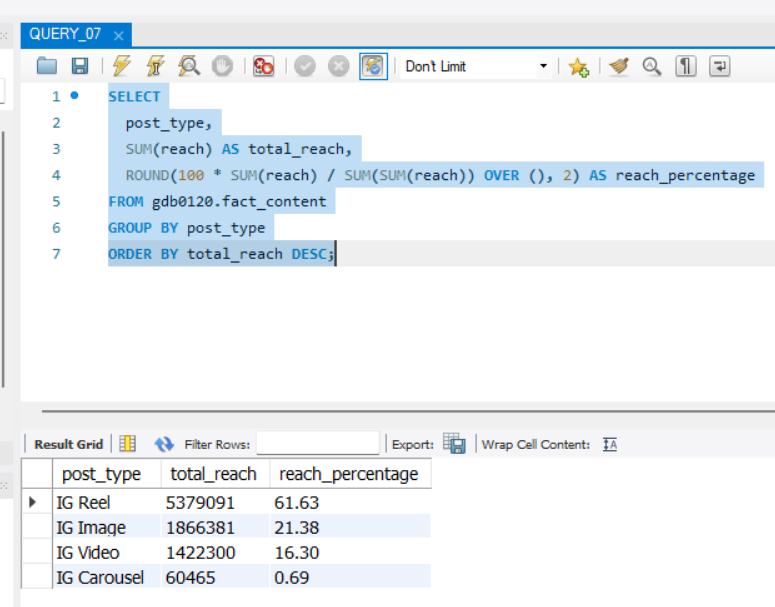
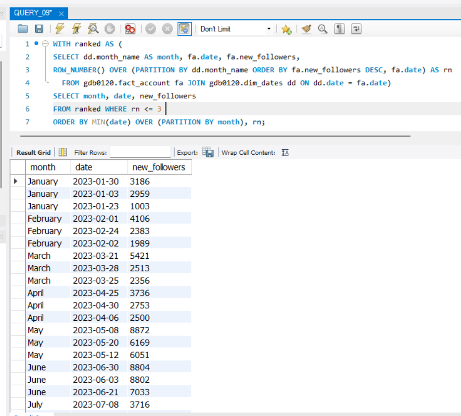

# Instagram Tech Influencer Analysis (SQL)
This project was completed as part of the Codebasics Virtual Internship.

## Objective
Analyze Instagram influencer performance data using SQL to derive insights on reach, engagement, impressions, and follower growth.

## Files Included
- sql_questions.pdf → Assignment questions

- QUERY_01.sql to QUERY_10.sql → SQL solutions

- Q1_output.csv to Q10_output.csv → Query results (outputs)

## Key Analysis
- Unique post types identification

- Highest & lowest impressions by content format

- Weekend posting analysis

- Monthly profile visits & follower growth

- Post category engagement analysis

- Reach percentage by post type

- Quarterly engagement trends

- Share behaviour analysis

## Tools Used
- MySQL

- SQL

## Question 01 – How many unique post types are found in the 'fact_content' table?

### SQL Query

```sql
SELECT
COUNT(DISTINCT post_type) AS unique_post_types
FROM gdb0120.fact_content;
```
### Output


## Question 02 – What are the highest and lowest recorded impressions for each post type? 

### SQL Query

```sql
  SELECT
  post_type,
  MAX(impressions) AS highest_impressions,
  MIN(impressions) AS lowest_impressions
  FROM gdb0120.fact_content
  GROUP BY post_type
  ORDER BY post_type;
```
### Output



## Question 03 – Filter all the posts that were published on a weekend in the month of March and April and export them to a separate csv file.

### SQL Query

```sql
SELECT fc.*
FROM gdb0120.fact_content fc 
JOIN gdb0120.dim_dates dd ON dd.date = fc.date 
WHERE dd.weekday_or_weekend = 'Weekend' 
AND dd.month_name IN ('March', 'April') 
ORDER BY fc.date, fc.post_type;

SELECT fc.*
FROM gdb0120.fact_content fc 
JOIN gdb0120.dim_dates dd ON dd.date = fc.date 
WHERE dd.weekday_or_weekend = 'Weekend' 
AND dd.month_name IN ('March', 'April')
INTO OUTFILE 'C:/ProgramData/MySQL/MySQL Server 8.0/Uploads/weekend_posts_mar_apr.csv'
FIELDS TERMINATED BY ',' 
ENCLOSED BY '"'
LINES TERMINATED BY '\n';
```
### Output


## Question 04 – Create a report to get the statistics for the account. The final output includes the following fields: 

• month_name 

• total_profile_visits 

• total_new_followers

### SQL Query

```sql
  SELECT
  dd.month_name,
  SUM(fa.profile_visits) AS total_profile_visits,
  SUM(fa.new_followers)  AS total_new_followers
  FROM gdb0120.fact_account fa
  JOIN gdb0120.dim_dates dd
  ON dd.date = fa.date
  GROUP BY dd.month_name
  ORDER BY MIN(dd.date);
```
### Output


## Question 05 – Write a CTE that calculates the total number of 'likes’ for each 'post_category' during the month of 'July' and subsequently, arrange the 'post_category' values in descending order according to their total likes.

### SQL Query

```sql
   WITH july_likes AS (
   SELECT
   fc.post_category,
   SUM(fc.likes) AS total_likes
   FROM gdb0120.fact_content fc
   JOIN gdb0120.dim_dates dd
   ON dd.date = fc.date
   WHERE dd.month_name = 'July'
   GROUP BY fc.post_category
)
   SELECT
   post_category,
   total_likes
   FROM july_likes
   ORDER BY total_likes DESC;
```
### Output


## Question 06 – Create a report that displays the unique post_category names alongside their respective counts for each month. The output should have three columns:  

• month_name 

• post_category_names  

• post_category_count 

Example:  

• 'April', 'Earphone,Laptop,Mobile,Other Gadgets,Smartwatch', '5' 

• 'February', 'Earphone,Laptop,Mobile,Smartwatch', '4' 

### SQL Query

```sql
  SELECT
  dd.month_name,
  GROUP_CONCAT(DISTINCT fc.post_category ORDER BY fc.post_category SEPARATOR ',') AS post_category_names,
  COUNT(DISTINCT fc.post_category) AS post_category_count
  FROM gdb0120.fact_content fc
  JOIN gdb0120.dim_dates dd
  ON dd.date = fc.date
  GROUP BY dd.month_name
  ORDER BY MIN(dd.date);
```
### Output


## Question 07 – What is the percentage breakdown of total reach by post type?  The final output includes the following fields: 

• post_type 

• total_reach 

• reach_percentage

### SQL Query

```sql
SELECT
  post_type,
  SUM(reach) AS total_reach,
  ROUND(100 * SUM(reach) / SUM(SUM(reach)) OVER (), 2) AS reach_percentage
FROM gdb0120.fact_content
GROUP BY post_type
ORDER BY total_reach DESC;
```
### Output

 

## Question 08 – Create a report that includes the quarter, total comments, and total saves recorded for each post category. Assign the following quarter groupings: 
(January, February, March) → “Q1” 

(April, May, June) → “Q2” 

(July, August, September) → “Q3” 

The final output columns should consist of: 

• post_category 

• quarter 

• total_comments 

• total_saves

### SQL Query

```sql
SELECT
  fc.post_category,
  CASE
    WHEN dd.month_name IN ('January','February','March') THEN 'Q1'
    WHEN dd.month_name IN ('April','May','June')        THEN 'Q2'
    WHEN dd.month_name IN ('July','August','September') THEN 'Q3'
    ELSE 'Other'
  END AS quarter,
  SUM(fc.comments) AS total_comments,
  SUM(fc.saves)    AS total_saves
FROM gdb0120.fact_content fc
JOIN gdb0120.dim_dates dd
  ON dd.date = fc.date
GROUP BY fc.post_category, quarter
ORDER BY fc.post_category, quarter;
```
### Output

 

## Question 09 – List the top three dates in each month with the highest number of new followers. The final output should include the following columns: 
• month 

• date 

• new_followers

### SQL Query

```sql
WITH ranked AS (
  SELECT
    dd.month_name AS month,
    fa.date,
    fa.new_followers,
    ROW_NUMBER() OVER (
      PARTITION BY dd.month_name
      ORDER BY fa.new_followers DESC, fa.date
    ) AS rn
  FROM gdb0120.fact_account fa
  JOIN gdb0120.dim_dates dd
    ON dd.date = fa.date
)
SELECT
  month,
  date,
  new_followers
FROM ranked
WHERE rn <= 3
ORDER BY MIN(date) OVER (PARTITION BY month), rn;
```
### Output



